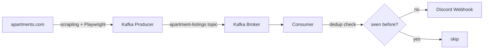

# Apartment Hunter

Automated apartment listing monitor that scrapes [apartments.com](https://www.apartments.com) on a schedule, streams listings through a Kafka pipeline, deduplicates them, and sends Discord alerts with photos.

## Demo


## Architecture



**Flow:**
1. You paste an apartments.com search URL with all your filters pre-applied (price, beds, baths, pets, location)
2. `scraper_producer.py` scrapes listing cards on a 15-minute schedule and publishes each one as a JSON message to the `apartment-listings` Kafka topic
3. `consumer_filter.py` polls the topic, checks each listing against a local deduplication file, and sends new listings to Discord

## Tech Stack

- **[Apache Kafka](https://kafka.apache.org/)** — message streaming between scraper and notifier (via `confluent-kafka`)
- **[Scrapling](https://github.com/D4Vinci/Scrapling)** — dynamic page scraping with Playwright
- **[Docker Compose](https://docs.docker.com/compose/)** — runs Kafka + Zookeeper locally
- **[uv](https://github.com/astral-sh/uv)** — Python package and project management

## Setup

### Prerequisites
- Docker + Docker Compose
- [uv](https://github.com/astral-sh/uv)

### 1. Clone and install dependencies

```bash
git clone https://github.com/yourusername/apartment-hunter
cd apartment-hunter
uv sync
uv run playwright install chromium
```

### 2. Configure environment

```bash
cp .env.example .env
```

Edit `.env` and add your Discord webhook URL ([how to create one](https://support.discord.com/hc/en-us/articles/228383668)).

### 3. Start Kafka

```bash
docker compose up -d
```

### 4. Run

Go to [apartments.com](https://www.apartments.com), apply all your filters (price, beds, baths, pets, location), and copy the URL. Then:

```bash
uv run python main.py "https://www.apartments.com/your-filtered-search-url"
```

The scraper runs immediately on start, then every 15 minutes. New listings appear in your Discord channel automatically. Already-seen listings are skipped so you don't get duplicate alerts.

## Project Structure

```
apartment_hunter/
├── main.py                # CLI entry point — accepts URL, spawns producer + consumer
├── scraper_producer.py    # Scrapes apartments.com → publishes to Kafka
├── consumer_filter.py     # Polls Kafka → deduplicates → Discord
├── notifier.py            # Discord webhook embed formatting
├── data_model.py          # Listing dataclass
├── docker-compose.yml     # Kafka + Zookeeper
└── .env.example           # Required environment variables
```
